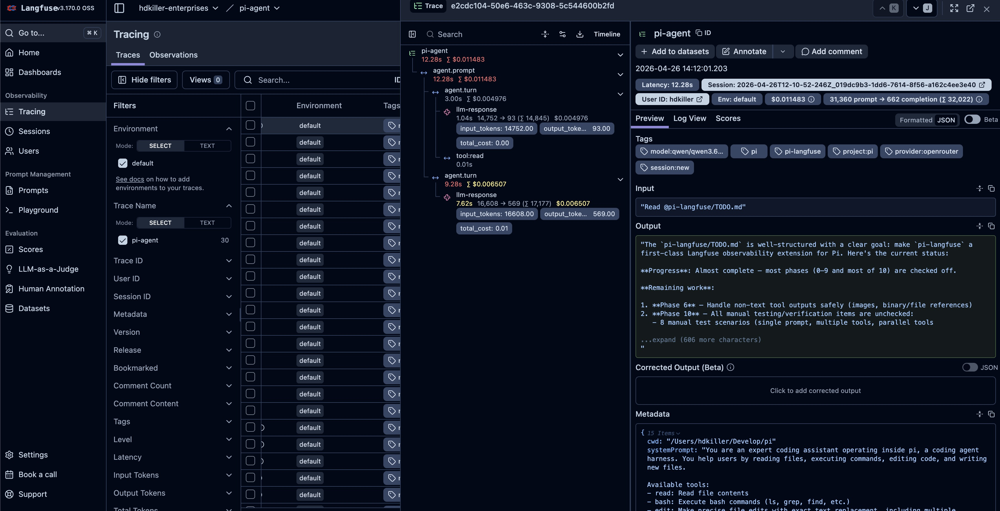

# @hdkiller/pi-langfuse

[](https://github.com/hdkiller/pi-langfuse/actions/workflows/ci.yml)
[](https://www.npmjs.com/package/@hdkiller/pi-langfuse)
[](https://opensource.org/licenses/MIT)

Production-grade Langfuse observability for [Pi Coding Agent](https://github.com/mariozechner/pi-coding-agent).



## Why Langfuse?

Langfuse provides open-source observability for LLM applications. This extension allows you to **trace**, **monitor**, and **debug** your Pi sessions with production-grade detail, helping you understand exactly how your agent is performing, what it's costing you, and where it might be failing.

## Features

- **Hierarchical Tracing**: Maps user prompts to per-turn spans and nested tool executions for deep visibility.
- **Streaming Generation**: Captures assistant responses (including "thinking" blocks) in real-time as they stream.
- **LLM Metadata**: Automatically records model name, provider, token usage, and API costs per turn.
- **Tool Observability**: Detailed logs for every tool call, including sanitized arguments, results, and duration.
- **Session Correlation**: Groups all prompts from the same Pi session into a single Langfuse session.
- **System Prompt Capture**: Automatically records the active system prompt in trace metadata.
- **Modern Semantics**: Built-in support for `release` and `environment` tagging.

## Quick Install

### 1. Install via Pi

```bash
# Optional: Install settings panel for GUI configuration
pi install npm:@axnic/pi-extension-settings

# Install Langfuse extension
pi install npm:@hdkiller/pi-langfuse
```

### 2. Configure API Keys

Get your keys from [Langfuse Cloud](https://cloud.langfuse.com) → Settings → API Keys.

Configuration precedence:
1.  `/extensions:settings` (highest, requires optional settings extension)
2.  `config.json`
3.  `LANGFUSE_*` environment variables (lowest)

## Configuration

| Setting | Env Var | Default | Description |
| :--- | :--- | :--- | :--- |
| **Enabled** | - | `true` | Global toggle for tracing. |
| **Public Key** | `LANGFUSE_PUBLIC_KEY` | - | Your Langfuse project public key. |
| **Secret Key** | `LANGFUSE_SECRET_KEY` | - | Your Langfuse project secret key. |
| **Base URL** | `LANGFUSE_HOST` | `https://cloud.langfuse.com` | API host (change for self-hosted). |
| **User ID** | `PI_LANGFUSE_USER_ID` | `$USER` | Associate traces with a specific user. |
| **Environment** | `PI_LANGFUSE_ENV` | - | Tag traces (e.g., `production`, `staging`). |
| **Release** | `PI_LANGFUSE_RELEASE` | - | Tag traces with a version or release ID. |

## Usage

### Quick Toggle
Use the slash command to toggle tracing on the fly:
```text
/langfuse:toggle [on|off]
```

### Trace Model
For a deep dive into the tracing model and data flow, see [docs/architecture.md](./docs/architecture.md).

```text
Trace (name: "pi-agent")
└── Span (name: "agent.prompt")
    └── Span (name: "agent.turn")
        ├── Generation (name: "llm-response")  <-- Cost/Token tracking
        └── Span (name: "tool:<name>")          <-- Arguments/Results
```

## Contributing

We welcome contributions! Please see our [Contributing Guide](./CONTRIBUTING.md) to get started with our modern Biome/Vitest toolchain.

## Troubleshooting

- **No traces?** Check your API keys and the Pi console for validation warnings.
- **Incomplete traces?** Ensure you are using a modern version of Pi that supports `message_*` events.
- **Large payloads?** Adjust the `max-chars` limits in the `/extensions:settings` panel.

## License

MIT
